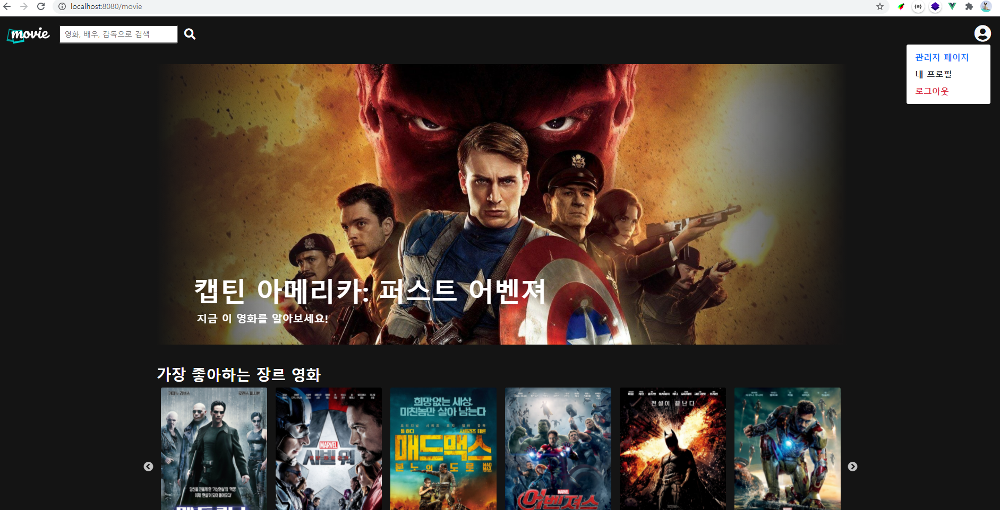
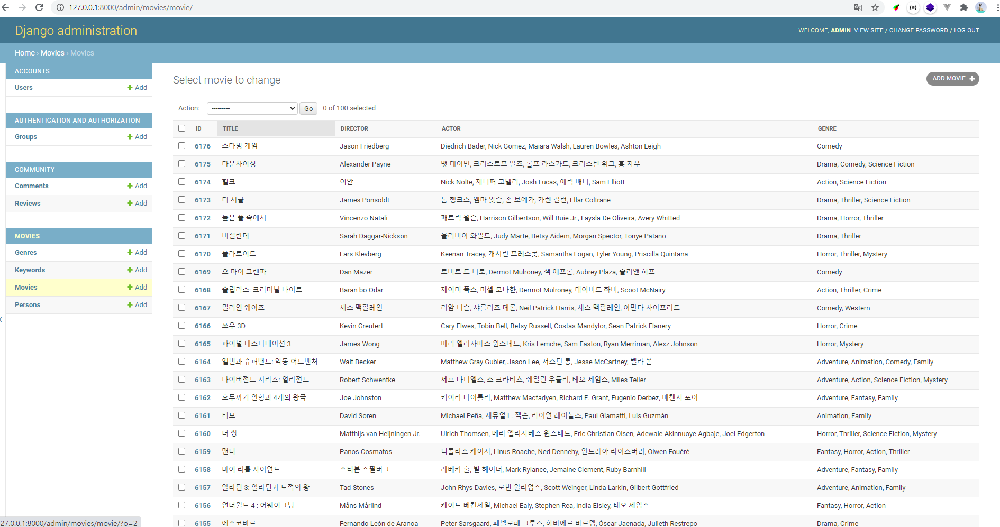
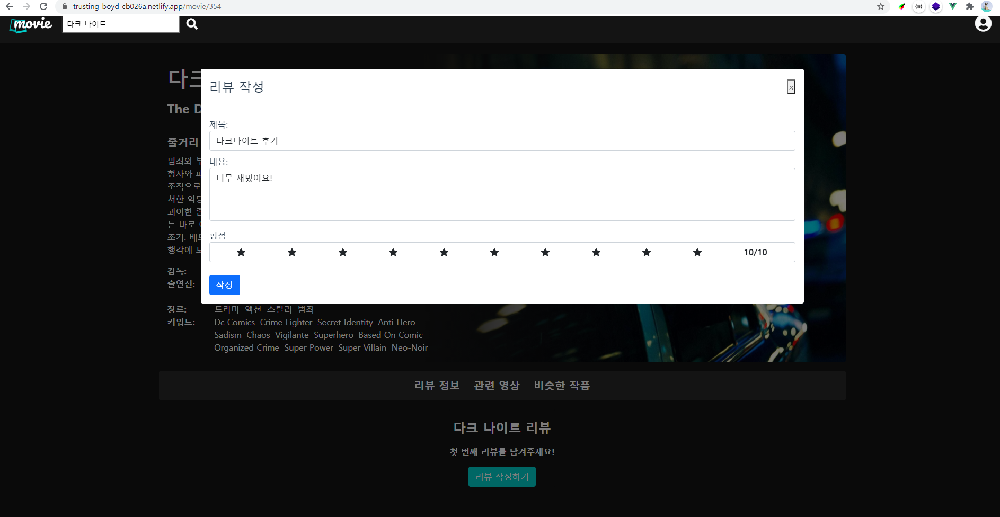
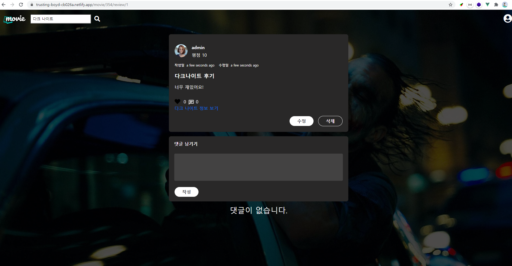
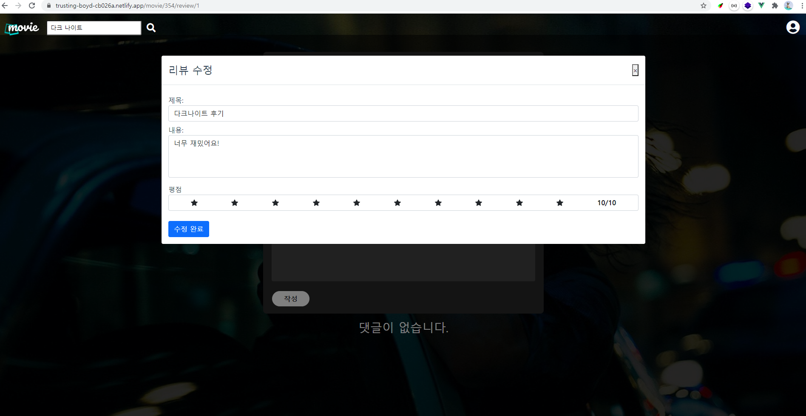
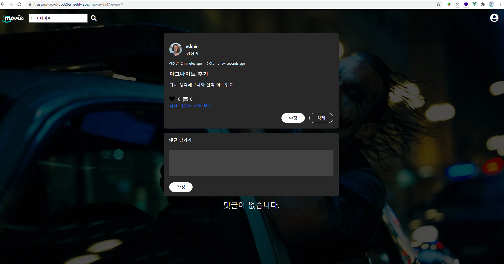

# README 정리

## 1. 팀원 정보 및 업무 분담 내역

## 2. 목표 서비스 구현 및 실제 구현 정도

## 3. 데이터베이스 모델링(ERD)

## 4. 필수 기능에 대한 설명

#### A. 관리자뷰

1. 관리자 권한의 유저만 영화 등록 / 수정 / 삭제 권한을 가집니다.
2. 관리자 권한의 유저만 유저 관리 권한을 가집니다.
3. 장고에서 기본적으로 제공하는 admin 기능을 이용하여 구현합니다.
4. Vue.js를 활용하는 경우에도 Django admin기능을 이용하여 구현할 수 있습니다.

- 영화와 유저에 대한 등록/ 수정/ 삭제 기능은 따로 만들지 않고 관리자 권한을 가진 유저만 Django의 admin페이지에 접근하여 수정 가능하도록 설계하엿습니다.
- Navbar의 프로필 버튼을 누르면 다음과 같이 관리자 유저면 관리자 페이지로 이동할 수 있는 버튼이 보입니다.

**<프로필 버튼 눌렀을 때>**

- 관리자 페이지를 누르면 a태그로 Django의 admin 페이지로 이동하도록 구현하였습니다.

#### B. 영화 정보

1. 영화 정보는 Database Seeding 을 활용하여 최소 50 개 이상의 데이터가 존재하도록 구성해야 합니다.

- 저희 팀은 TMDB API를 이용하여 TMDB 서버로부터 한국 인기 영화와 평점 높은 영화를 받아서 간단한 필터링 작업을 거친 후 DB를 구축하였습니다.
  - 영화 포스터가 없는경우
  - 감독, 배우 등의 필수 DB가 누락된 경우
  - 두 API에서 겹치는 데이터를 필터링 하기 위해서 이미 저장한 영화인 경우 패스
- 배우와 감독의 이름이 영어로 제공되기 때문에 한글로 변환하는 작업을 진행하였습니다.
  - 배우의 Detail 페이지에 한글 이름이 있는 경우가 있고 없는 경우가 있었기 때문에, 네이버의 한글 감지 API를 이용하여 한글이 있는 경우에 한국어 이름까지 저장했습니다.
- TMDB에서 제공하는 영화별 키워드도 받아서 저장하였는데 중복되는 키워드를 카운트하는 속성을 따로 만들었습니다.
  - 6000개가 넘는 전체 데이터중에서 10개 미만의 데이터가 나오는 경우 무의미한 데이터라고 판단하여 삭제하는 후처리 작업을 진행하였습니다.

- 사용 API
  1. 영화에 대한 정보: TMDB `/movie/popular`, `/movie/top_rated`
  2. 장르에 대한 정보: TMDB `/genre/movie/list`
  3. 단일 영화의 배우와 감독에 대한 정보: TMDB `/movie/{movie_id}/credits`
  4. 단일 배우와 감독에 대한 정보:`/person/{person_id}`
  5. 단일 영화에 대한 키워드: `/movie/{movie_id}/keywords`
  6. 네이버 파파고 언어감지

- `urls.py`에 path를 만들어서 `127.0.0.1:8000/api/m1/updateDB/` 로 요청을 보내면 TMDB API를 이용한 알고리즘을 통해 자동으로 DB를 업데이트 할 수 있습니다.
- 최종적으로 6176개의 영화와 19개의 장르, 16236명의 배우와 감독, 684개의 키워드로 이루어진 데이터베이스를 구축했습니다.

- 모든 로그인 된 유저는 영화에 대한 평점 등록 / 수정 / 삭제 등을 할 수 있어야 합니다.

1. **평점등록**

**<리뷰+평점 등록>**

- 리뷰를 등록하면 리뷰가 등록되며 등록한 리뷰 상세정보 페이지로 이동한다.

2. **수정 및 삭제**

**<리뷰 상세정보 페이지>**

**<리뷰 수정>**

- 리뷰 수정 버튼을 누르면 기존에 작성한 리뷰를 보여주는 모달 창이 나온다.
- 리뷰를 수정하고 수정 완료 버튼을 누르면 리뷰 및 평점이 수정된다.
- 삭제 버튼을 누르면 리뷰가 삭제되면서 Home 페이지로 돌아간다.

**<리뷰 수정 완료>**

#### C. 추천 알고리즘

#### D. 커뮤니티

#### E. 기타

## 5. 배포 서버 URL

DRF Server (HEROKU) : https://drf-server-deploy-test123.herokuapp.com/

Vuejs Clien (netlify)t: https://trusting-boyd-cb026a.netlify.app/

## 6. 기타(느낀점)

