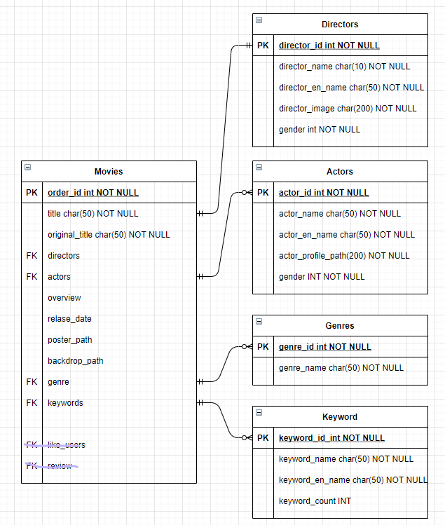

# last pjt

#### 0519

- **movies model 작성**
- **URL 정리** = POSTMAN 파일로 올림 (final_pjt.postman_collection.json)
- account 수업때 했던 코드 옮겨놈
- drf, drf-jwt, cors 설치해놈 -> freeze완료

```python
# top_rated 영화
MOVIE_URL = f'https://api.themoviedb.org/3/movie/top_rated?api_key={token}&language=ko-KR&page={page}'

# popular region = KR
f'https://api.themoviedb.org/3/movie/popular?api_key={token}&language=ko-KR&page={pagee}&region=KR'

# 전체 장르
GENRE_URL = f'https://api.themoviedb.org/3/genre/movie/list?api_key={token}&language=ko-KR'

# 영화의 CREDIT 목록 (PEOPLE)
MOVIE_CREDIT_URL = f'https://api.themoviedb.org/3/movie/{movie_id}/credits?api_key={token}&language=ko-KR'

# 배우 DETAIL
ACTOR_DETAIL_URL = f'https://api.themoviedb.org/3/person/{actor_id}?api_key={token}&language=ko-KR'

# 감독 DETAIL
DIRECTOR_DETAIL_URL = f'https://api.themoviedb.org/3/person/{director_id}?api_key={token}&language=ko-KR'

# 영화 KEYWORD
MOVIE_KEYWORD_URL = f'https://api.themoviedb.org/3/movie/{movie_id}/keywords?api_key={token}'
```


- 현재 모델 상황




- 할 일
  1. token 숨기기(.env 사용?)
  2. 영화 POPULAR, NATION 등 지정했을 때 중복 잘 들어가는지 확인하기
  3. url으로 실행하는 법 말고 다른 방법 있는지?
