# README 정리

## 1. 팀원 정보 및 업무 분담 내역

**박상욱(팀장)**  

> front-end 책임자

- 프로젝트 방향 구상 및 ERD 작성
- 피그마 UI, UX 디자인
- vuex store module 설계
- front-end 최종 디자인

**방지환** 

> back-end 책임자

- 프로젝트 방향 구상 및 ERD 작성
- DRF 서버, django-model 설계

- 추천 알고리즘 설계
- front-end 필요한 위치에 간단히 구현

## 2. 데이터베이스 모델링(ERD)

> draw.io 를 이용하여 설계

- Movies와 Genres, Keyword, Person(배우 ,감독), user_likes는 M:N관계
  - 하나의 영화가 여러개의 값을 가질 수 있고 하나의 Genre, Keyword, Person, User도 여러개의 좋아요를 누를 수 있다.
- Movies와 Review 는 1: N 관계
  - 하나의 영화는 여러개의 리뷰를 가질 수 있다.
  - Review와 Comment도 1:N 관계
    - 하나의 리뷰에 여러개의 댓글을 가질 수 있다.

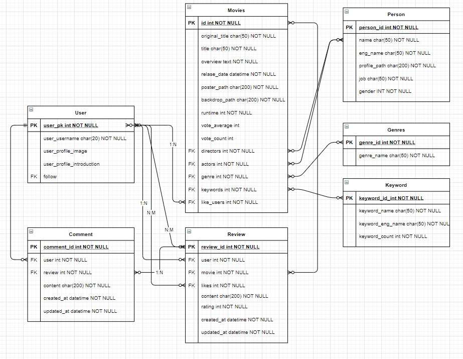

## 3. 필수 기능

#### A. 관리자뷰

1. 관리자 권한의 유저만 영화 등록 / 수정 / 삭제 권한을 가집니다.
2. 관리자 권한의 유저만 유저 관리 권한을 가집니다.
3. 장고에서 기본적으로 제공하는 admin 기능을 이용하여 구현합니다.
4. Vue.js를 활용하는 경우에도 Django admin기능을 이용하여 구현할 수 있습니다.

- 영화와 유저에 대한 등록/ 수정/ 삭제 기능은 따로 만들지 않고 관리자 권한을 가진 유저만 Django의 admin페이지에 접근하여 수정 가능하도록 설계하엿습니다.
- Navbar의 프로필 버튼을 누르면 다음과 같이 관리자 유저면 관리자 페이지로 이동할 수 있는 버튼이 보입니다.

**<프로필 버튼 눌렀을 때>**

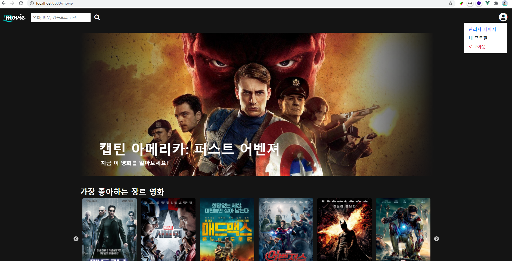

- 관리자 페이지를 누르면 a태그로 Django의 admin 페이지로 이동하도록 구현하였습니다.

#### B. 영화 정보

1. 영화 정보는 Database Seeding 을 활용하여 최소 50 개 이상의 데이터가 존재하도록 구성해야 합니다.

- 저희 팀은 TMDB API를 이용하여 TMDB 서버로부터 한국 인기 영화와 평점 높은 영화를 받아서 간단한 필터링 작업을 거친 후 DB를 구축하였습니다.
  - 영화 포스터가 없는경우
  - 감독, 배우 등의 필수 DB가 누락된 경우
  - 두 API에서 겹치는 데이터를 필터링 하기 위해서 이미 저장한 영화인 경우 패스
- 배우와 감독의 이름이 영어로 제공되기 때문에 한글로 변환하는 작업을 진행하였습니다.
  - 배우의 Detail 페이지에 한글 이름이 있는 경우가 있고 없는 경우가 있었기 때문에, 네이버의 한글 감지 API를 이용하여 한글이 있는 경우에 한국어 이름까지 저장했습니다.
- TMDB에서 제공하는 영화별 키워드도 받아서 저장하였는데 중복되는 키워드를 카운트하는 속성을 따로 만들었습니다.
  - 6000개가 넘는 전체 데이터중에서 10개 미만의 데이터가 나오는 경우 무의미한 데이터라고 판단하여 삭제하는 후처리 작업을 진행하였습니다.

- 사용 API
  1. 영화에 대한 정보: TMDB `/movie/popular`, `/movie/top_rated`
  2. 장르에 대한 정보: TMDB `/genre/movie/list`
  3. 단일 영화의 배우와 감독에 대한 정보: TMDB `/movie/{movie_id}/credits`
  4. 단일 배우와 감독에 대한 정보:`/person/{person_id}`
  5. 단일 영화에 대한 키워드: `/movie/{movie_id}/keywords`
  6. 네이버 파파고 언어감지

- `urls.py`에 path를 만들어서 `127.0.0.1:8000/api/m1/updateDB/` 로 요청을 보내면 TMDB API를 이용한 알고리즘을 통해 자동으로 DB를 업데이트 할 수 있습니다.
- 최종적으로 **6176개의 영화**와 **19개의 장르**, **16236명의 배우와 감독**, **684개의 키워드**로 이루어진 데이터베이스를 구축했습니다.

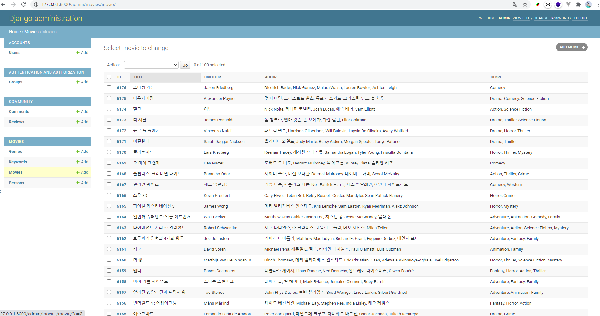

- 모든 로그인 된 유저는 영화에 대한 평점 등록 / 수정 / 삭제 등을 할 수 있어야 합니다.

1. **평점등록**

**<리뷰+평점 등록>**

- 리뷰를 등록하면 리뷰가 등록되며 등록한 리뷰 상세정보 페이지로 이동한다.

2. **수정 및 삭제**

**<리뷰 상세정보 페이지>**

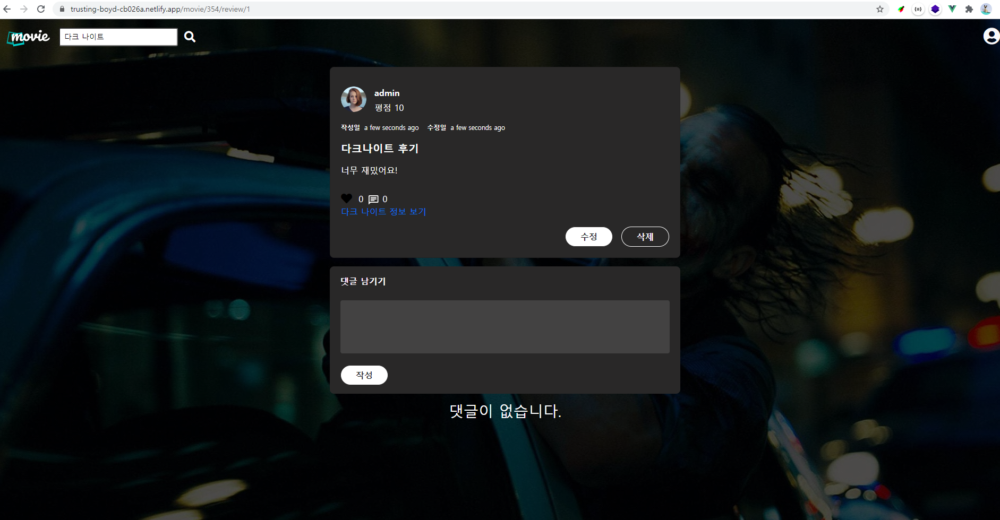

**<리뷰 수정>**

- 리뷰 수정 버튼을 누르면 기존에 작성한 리뷰를 보여주는 모달 창이 나온다.
- 리뷰를 수정하고 수정 완료 버튼을 누르면 리뷰 및 평점이 수정된다.
- 삭제 버튼을 누르면 리뷰가 삭제되면서 Home 페이지로 돌아간다.

**<리뷰 수정 완료>**

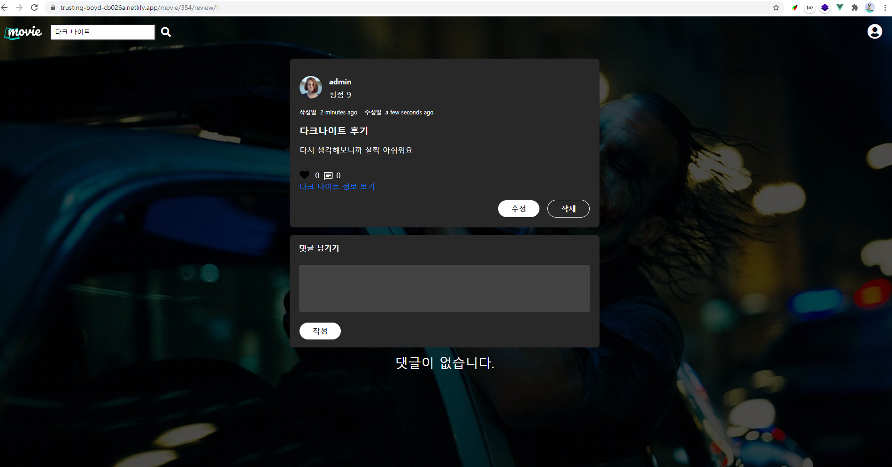

#### C. 추천 알고리즘

1. 평점을 등록한 유저는 해당 정보를 기반으로 영화를 추천 받을 수 있어야 합니다
   - 좋아요를 누른 영화를 기반으로 추천 알고리즘을 작성
   - 좋아요를 누른 영화와 장르가 최대한 많이 겹치는 영화를 추천했습니다.
   - 제일 좋아하는 1개의 장르를 가장 상단에 보여주고 그 다음으로 좋아하는 1번과 겹치지 않는 2, 3, 4순위의 장르들의 장르를 추천했습니다.
   - 로그인한 사용자가 제일 좋아하는 키워드 1개를 선정하여, 같은 키워드를 갖는 영화를 추천했습니다.

2. 추천 알고리즘의 지정된 형식은 없으나 사용자는 반드시 최소 1 개 이상의 방식으로 영화를 추천 받을 수 있어야 합니다.

3. 추천 방식은 각 팀별로 자유롭게 선택할 수 있으며 어 떠한 방식으로 추천 시스템을 구성 했는지 설명할 수 있어야 합니다.

🔎**제일 좋아하는 장르 + 2,3,4순위 장르와 유사한 영화 추천**

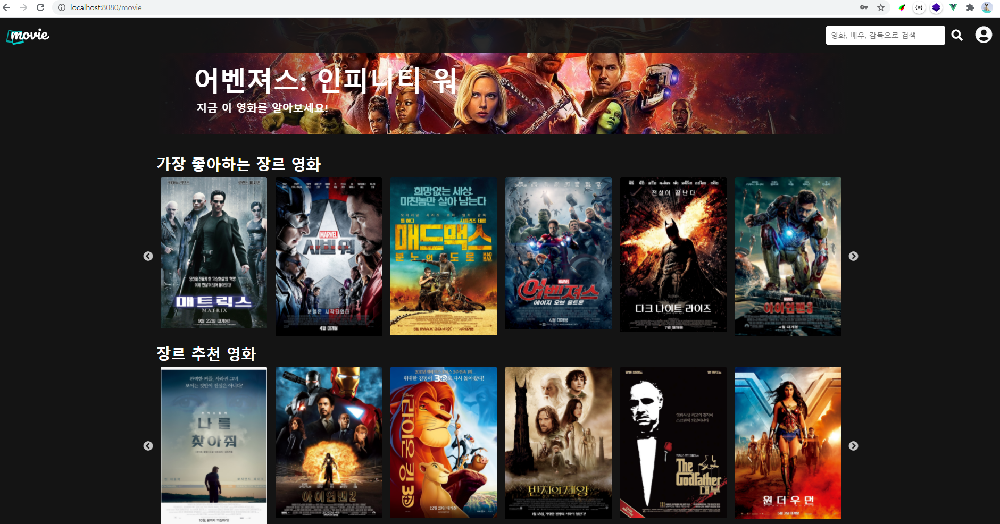

🔎**키워드별 + 랜덤 추천 + 최신 영화 추천**

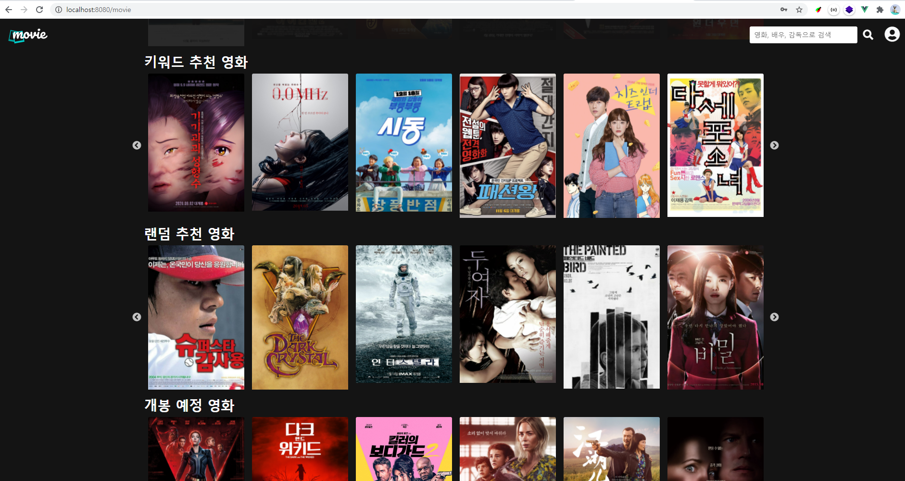

🔎 **영화 정보 상세보기 페이지**

> 영화 디테일 페이지에서 비슷한 장르 버튼을 누르면 모든 장르가 완전히 겹치거나(장르가 1,2개 인 경우도 있기 때문)
>
> 3개 이상 겹치는 영화들을 비슷한 작품으로 추천해준다.

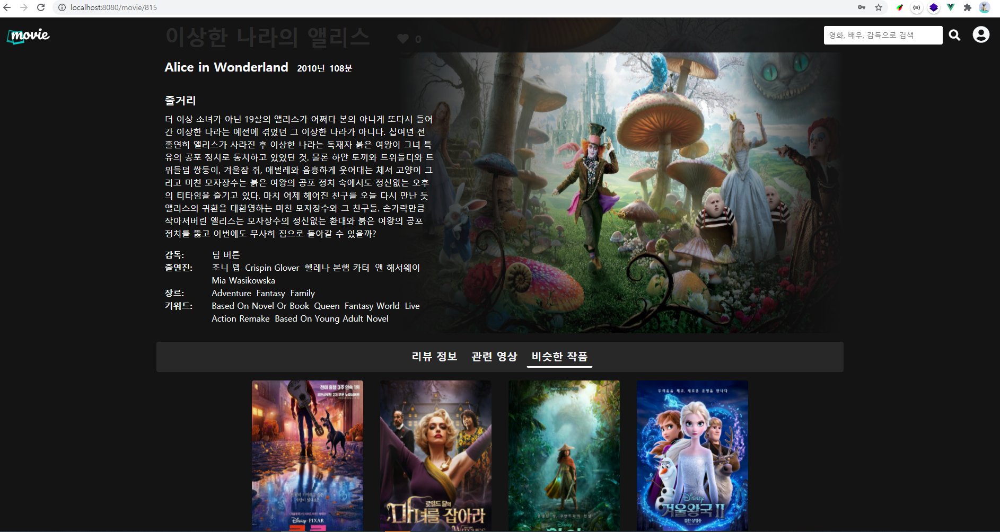

#### D. 커뮤니티

i. 영화 정보와 관련된 대화를 할 수 있는 커뮤니티 기능을 구현해야 합니다

- 영화 상세정보에 들어가면 사용자들끼리 리뷰를 작성하고 댓글을 남길 수 있도록 구현해놨습니다.

**🔎영화 Detail 페이지**

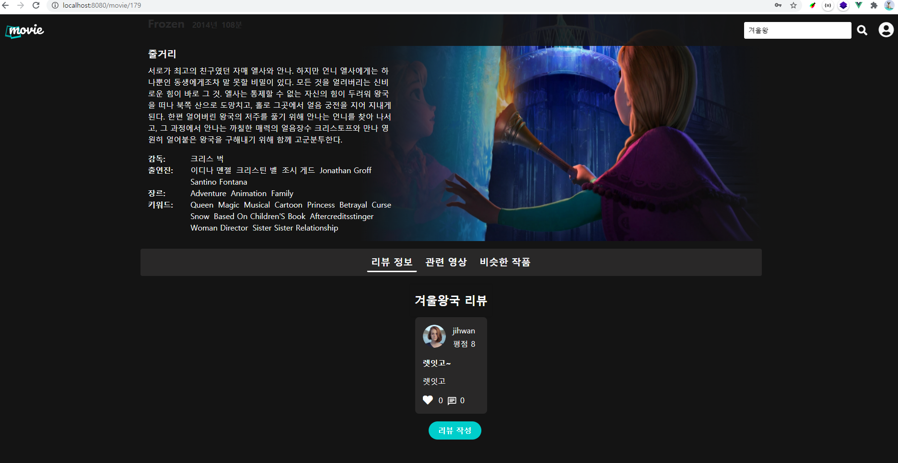

ii. 로그인한 사용자만 글을 조회 / 생성 할 수 있으며 작성자 본인만 글을 수정 삭제 할 수 있습니다.

iii. 사용자는 작성된 게시글에 댓글을 작성할 수 있어야 하며 작성자 본인만 댓글을 삭제 할 수 있습니다.

iv. 각 게시글 및 댓글은 생성 및 수정 시각 정보가 포함되어야 합니다.

**🔎 리뷰 Detail**

- 리뷰와 댓글 모두 본인이 아니면 수정/ 삭제 버튼이 보이지 않고, django-server로 요청이 가더라도 저장이 되지 않도록 막아놨습니다.

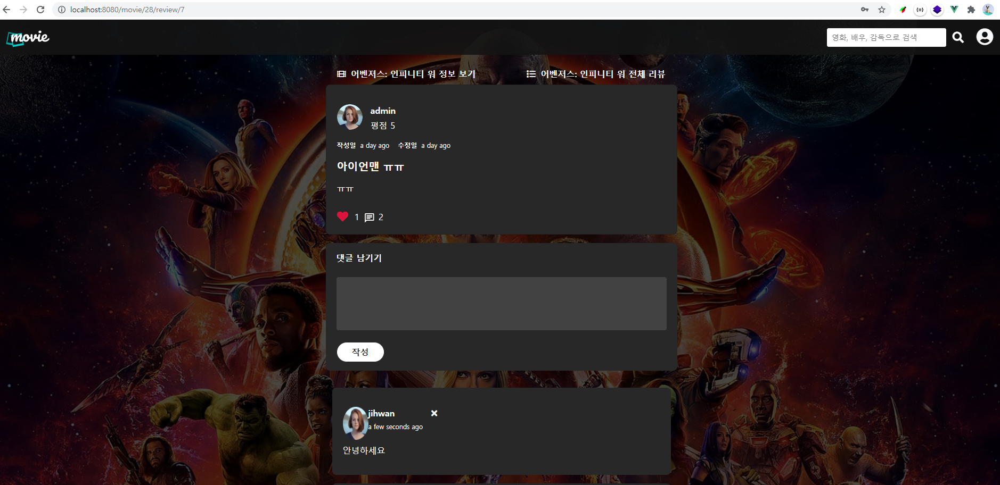

#### E. 기타

i. 최소한 5 개 이상의 URL 및 페이지를 구성해야 합니다.

- `SERVER_URL`  +
  - /login/ : 로그인 페이지
  - /signup/ : 회원가입 페이지
  - /movieselect/ : 초기 5개의 선호 영화 고르는 페이지
  - /movie/ :  메인 페이지
  - /movie/{movie_id} : 영화 상세정보 페이지
  - /movie/{movie_id}/review/{review_id} : 영화에 해당하는 리뷰 보여주는 페이지
  - /profile/username : 유저 프로필
  - /search?q={검색어} : 검색 결과 보여주는 페이지

ii. HTTP Method 와 상태 코드는 상황에 맞게 적절하게 반환되어야 하며 필요에 따라 메시지 프레임워크 등을 사용하여 에러 페이지를 구성해야 합니다.

- 로그인, 회원 가입 시 실패하면 경고창으로 에러 관련 경고창 구현

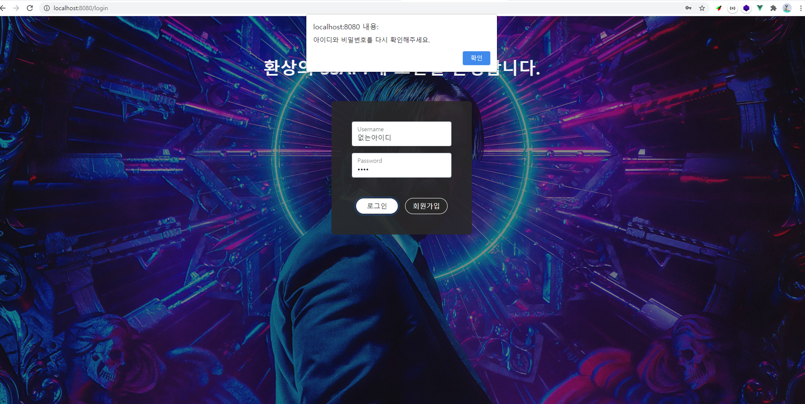

- 제공하지 않는 url 접근 시(404 error) 보여주는 페이지 생성

iii. 필요한 경우 Ajax 를 활용한 비동기 요청을 통해 사용자 경험을 적절하게 향상 시켜야 합니다.

- 초기 페이지와 검색결과를 띄워줄 때 로딩 딜레이를 넣어줘서 사용자 경험을 향상 시켰습니다.

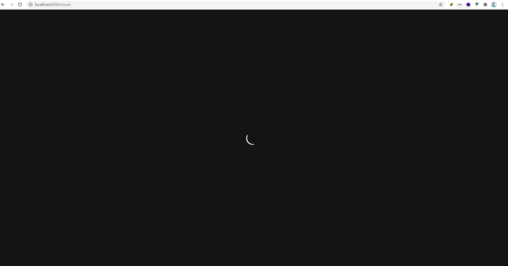

## 4. 목표 서비스 구현 및 실제 구현 정도

🎈 **앞의 필수 기능은 모두 구현 완료**

- 페이지 간 뷰라우터를 이용하여 자유롭게 이동 가능
  - 프로필에서 다른 유저의 프로필로 이동하는 뷰 라우터가 제대로 동작하지 않아서 a태그로 대체하였습니다.

- vuex module을 movie, account, community로 나누어 목적에 맞게 vuex store module을 이용하여 원하는 정보 가져다 쓸 수 있었습니다.

- 처음에 로그인 하면 추천을 위한 데이터를 얻기 위해 선호 영화를 선택하는 페이지를 구상하였고 구현할 수 있었습니다.

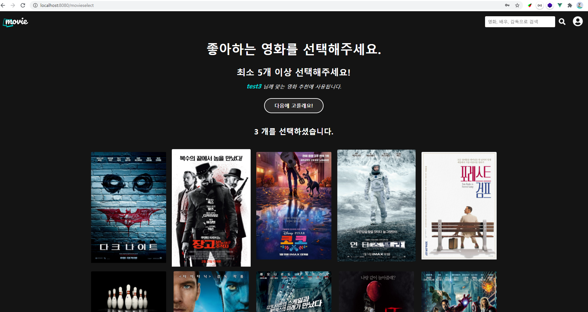

- 영화, 영화 내용, 배우, 감독을 이용하여 검색 기능을 구현했습니다.
  - 검색 이후 검색창이 초기화 되도록 만드는 것을 구현하지 못했습니다.
- heroku와 netlify를 이용한 배포 테스트 완료

## 5. 배포 서버 URL

DRF Server (HEROKU) : https://drf-server-deploy-test123.herokuapp.com/

Vuejs Clien (netlify)t: https://trusting-boyd-cb026a.netlify.app/

## 6. 기타(느낀점)

