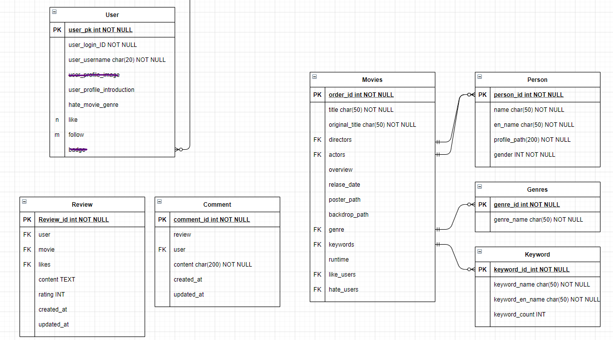

# final pjt

> 초기세팅: final_pjt_back에 .env 파일 만들어서 다음과 같이 사용

```bash
# install 필요
$ pip install python-decouple
# .env
MOVIE_API_KEY={TMDB_KEY}
X_Naver_Client_Id={X_Naver_Client_Id}
X_Naver_Client_Secret={X_Naver_Client_Secret}
```

```python
# movies/views.py
from decouple import config
MOVIE_API_KEY = config('MOVIE_API_KEY')
X_Naver_Client_Id = config('X_Naver_Client_Id')
X_Naver_Client_Secret = config('X_Naver_Client_Secret')
```


```bash
$ python manage.py migrate
$ python manage.py createsuperuser
```


### front

> npm i + .env.local 에 아래꺼 추가

```bash
VUE_APP_SERVER_URL=http://127.0.0.1:8000
```


### Commit 규칙

1. 첫 문자는 대문자 and 동사 (Update, Create, Delete...)
2. 두 번째는 front 인지 back 인지 (front, back)
3. 추가한 기능 + (수정한 파일)

```bash
$ git commit -m "Update back signup view.py"

$ git commit -m "Update front movie_detail Detail.Vue"
```


### Git branch

```bash
# 확인
$ git branch

# 생성
$ git branch <branch name>

# 이동
$ git switch <branch name>

# 삭제
$ git branch -D <branch name>

# 병합
$ git merge <branch name>
$ git log --oneline --graph
$ git branch -d <branch name> 삭제해준다
```


#### 작업 순서

1. 생성
2. 이동
3. 작업 (이동한 branch에서 작업)
4. git push (작업한 branch에서 push)
   - $ git push origin `<branch name>`
5. 원격 저장소에서 merge(pull request)
6. 충돌 없으면 merge 하고, 충돌 있으면 상의
7. 로컬 + 원격에서  branch 삭제


#### 0519

- **movies model 작성**
- **URL 정리**
- account 수업때 했던 코드 옮겨놈
- drf, drf-jwt, cors 설치해놈 -> freeze완료

```python
# top_rated 영화
MOVIE_URL = f'https://api.themoviedb.org/3/movie/top_rated?api_key={token}&language=ko-KR&page={page}'

# popular region = KR
f'https://api.themoviedb.org/3/movie/popular?api_key={token}&language=ko-KR&page={pagee}&region=KR'

# 전체 장르
GENRE_URL = f'https://api.themoviedb.org/3/genre/movie/list?api_key={token}&language=ko-KR'

# 영화의 CREDIT 목록 (PEOPLE)
MOVIE_CREDIT_URL = f'https://api.themoviedb.org/3/movie/{movie_id}/credits?api_key={token}&language=ko-KR'

# 배우 DETAIL
ACTOR_DETAIL_URL = f'https://api.themoviedb.org/3/person/{actor_id}?api_key={token}&language=ko-KR'

# 감독 DETAIL
DIRECTOR_DETAIL_URL = f'https://api.themoviedb.org/3/person/{director_id}?api_key={token}&language=ko-KR'

# 영화 KEYWORD
MOVIE_KEYWORD_URL = f'https://api.themoviedb.org/3/movie/{movie_id}/keywords?api_key={token}'
```


- 현재 모델 상황


#### 0520

- 현재 모델 상황
- Director + Actor = Person 으로 교체




- server/url 수정 완료
- 전체 영화, 단일 영화 시리얼라이즈+view 완료
- serializers 추천 알고리즘, Profile 제외하고 완료

#### 0521

- serializers profile, 검색
- profile 페이지 초안 완료


## 고민해야 할 사항

### 0520

#### back

1. review 작성 시 영화를 DB에 있는 것만 작성을 할 수 있게 하려고 하는데 선택지가 너무 많아진다
   - 해결할 방법 필요 or 검색
2. Keyword 번역문제 아직 해결 안됨
3. user_profile_image => 사진으로 하면 저장할 방법 필요 => 캐릭터같은거 선택지를 준다.
4. movie에 연결된 like와 hate 각각 처리했는데, like가 눌리면 hate가 취소되고 반대로도 되야함
   - front랑 back 에서 모두 처리해야 할듯

### 0521

#### back

1. keyword로 검색 기능 구현해야함

3. 키워드 관련 전처리 필요
   - 키워드를 비율로 보고 정리할지? 혹은 일정 count 수가 안되면 바로 삭제할지?
   - 만약 키워드가 하나도 없는 영화가 있다면 어떻게 보여줄지? -> front에서 만약 length가 0이면 보여주지 않는다?
4. review 모델 컬럼명 수정 필요할듯..!
   - movie -> movie_id


### 0522

#### front

네비게이션 에러

```
NavigationDuplicated: Avoided redundant navigation to current location: "/search?q=%EC%B9%B4%EC%98%A4%EC%8A%A4"."
```


타입에러

```
TypeError: Cannot read property 'length' of undefined
```

=> 데이터 없는 경우 undefined는 length 구할수 없음


### 0522

> JavaScript 배열에서 값 제거할 때 pop(data)로 안되고 indexOf로 값 찾은다음 splice 해야함


처음에 선택할 때 15개 중에서 이미 좋아요 누른게 있을 수 있음

- 처리 필요함


```
if serializer.is_valid(raise_exception=True):
=> 통과 못해서
Validation error => 400 bad request 발생
```

print(serializer.errors) 찍으면 무슨 에러인지 알 수 있음

movie를 id값 넘겨줘야 되고, user정보를 넘기지 않아서 발생했었음.


-> 리뷰 작성 시에 rating 1~10 아닌 값 입력으로 작성은 되서 막는 방법 필요


### 0523

초기 좋아요 영화 설정 시에 이미 좋아요 누른 영화 표시하려고함

=> 이미 좋아요 누른건 좋아요 취소 안되도록 view하나 더 만들어서 해결


### 0524

profile/admin -> profile/jihwn 으로 넘어가는데 라우터링크로 하면  jihwan으로 바뀌었다가 다시 돌아옴.

a태그로 하니까 새로고침되면서 해결되는데 정확한 이유는 모르겠음.


### 0525

movieselect 에서 skip 가능하게 => 추천영화 없으면 movie select로 이동 버튼 생성

초기 페이지 login페이지로

없는 url 입력시 이동하는 페이지 설정

a태그로 django admin 페이지 하드코딩해서 보냄 (127.0.0.1:8000/admin/)

초기 페이지 장르별로 1개씩 뽑아서 보여주기  완료

imdb_id 값이 없는 영화 필터링 => 이상한 영화들이 많이 저장되서 거름


### 0526

```
# error
django.db.utils.OperationalError: parser stack overflow
```

person 너무 많아서 recurssion 에러발생
